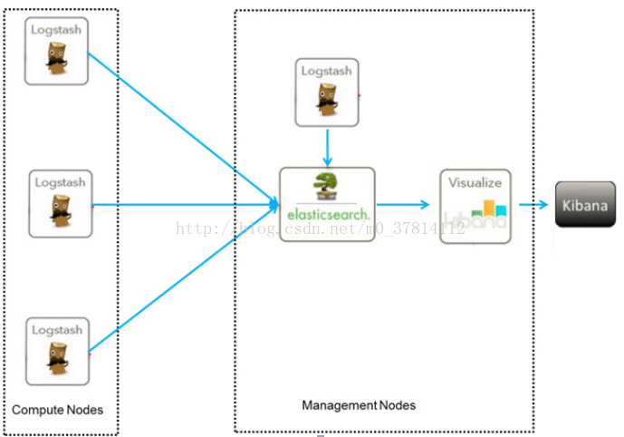

### ELK 日志分析学习
#### ELK组成
- Elasticsearch
- Logstach
- Kibnba

>- Elasticsearch
>>- 是一个基于 Lucene 的、支持全文索引的分布式存储和索引引擎，主要负责将日志索引并存储起来，方便业务方检索查询
>- Logstach
>>- 是一个日志收集、过滤、转发的中间件，主要负责将各条业务线的各类日志统一收集、过滤后，转发给 Elasticsearch 进行下一步处理。(输入，过滤，输出)
>- Kibnba
>>- 是一个可视化工具，主要负责查询 Elasticsearch 的数据并以可视化的方式展现给业务方，比如各类饼图、直方图、区域图等。

#### 架构

